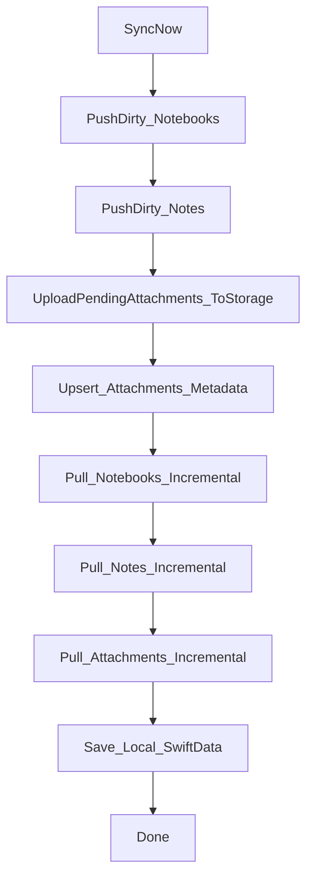

## NoteLab Supabase 数据同步机制（给 macOS 新项目接入用）

> **目的**：让 macOS 独立项目接入同一套 Supabase 数据库（含 Storage 附件桶），实现与当前 iOS 端一致的同步行为，并尽量避免 **覆盖未同步编辑**、**附件 RLS 拒绝**、**版本冲突丢数据**、**增量拉取漏数据** 等问题。  
> 本文以当前 iOS 工程实现为准：`NoteLab/Sync/SyncEngine.swift`、`supabase/schema.sql`、`NoteLab/Supabase/SupabaseManager.swift`、`NoteLab/Storage/AttachmentStorage.swift`、`NoteLab/Persistence/LocalModels.swift`。

---

### 1) 服务端前置条件（必须与 iOS 端一致）

#### 1.1 数据库 schema（public）
在 `supabase/schema.sql` 中定义并依赖以下对象：

- **表**：
  - `public.notebooks`
  - `public.notes`
  - `public.attachments`（附件元数据表）
- **字段（关键）**：
  - `notebooks`: `id`, `user_id`, `title`, `color`, `icon_name`, `created_at`, `updated_at`, `deleted_at`
  - `notes`: `id`, `user_id`, `notebook_id`, `title`, `summary`, `content`, `paragraph_count`, `bullet_count`, `has_additional_context`, `created_at`, `updated_at`, `version`, `deleted_at`  
    - 注意 `content_rtf` 存在但跨端协议主用 `content`（详见 iOS 同步实现）
  - `attachments`: `id`, `user_id`, `note_id`, `storage_path`, `file_name`, `mime_type`, `file_size`, `created_at`, `updated_at`, `deleted_at`

#### 1.2 RLS（Row Level Security）
三张表均启用 RLS，策略均为：**只允许 `user_id = auth.uid()` 的行**进行 select/insert/update/delete。

#### 1.3 updated_at 与 notes.version
schema 内有两类触发器：
- `set_updated_at_*`：所有表在 update 前写入 `updated_at = now()`
- `bump_version_notes`：`public.notes` 在 update 前 `version = old.version + 1`

这决定了客户端同步机制必须包含：
- 增量拉取依据：`updated_at`
- 乐观锁（optimistic locking）：更新 notes 时必须带上“期望 version”

#### 1.4 Storage：attachments bucket 与 RLS
schema 创建了 Storage bucket：`attachments`，且 storage.objects 的 RLS 约束：

- 文件对象必须满足：`bucket_id = 'attachments'`
- 且路径第一段必须等于登录用户：`(storage.foldername(name))[1] = auth.uid()::text`

**因此 storagePath 必须形如**：

```text
{user_id}/{filename}
```

且 `{user_id}` 必须等于当前 session 的 `user.id`，否则会 403（RLS 拒绝）。

---

### 2) 客户端本地数据模型（macOS 端应与 iOS 字段语义一致）

iOS 端使用 SwiftData 模型（`NoteLab/Persistence/LocalModels.swift`），macOS 端建议保持同样字段语义，尤其是：

#### 2.1 LocalNotebook（本地笔记本缓存）
关键字段：
- `id`：与远端主键一致（uuid）
- `ownerId`：当前登录用户 id（uuid）
- `remoteUpdatedAt`：最近一次从远端确认的更新时间
- `deletedAt`：软删除时间（与远端 deleted_at 对齐）
- `isDirty`：本地是否有未同步的改动（pushDirty 的筛选条件）

#### 2.2 LocalNote（本地笔记缓存）
关键字段：
- `id`：远端主键
- `ownerId`
- `notebook`（关系）
- `content`：**同步权威正文（Markdown 字符串）**
- `version`：与远端 notes.version 对齐，用于乐观锁
- `remoteUpdatedAt`
- `deletedAt`
- `isDirty`：本地未同步编辑标记
- `conflictParentId`：发生冲突时用于“冲突副本”的来源追踪

> iOS 端在拉取落库时 `contentRTF` 置为 nil，说明跨端主用 `content`。macOS 端应优先把编辑结果写入 `content` 并更新统计字段。

#### 2.3 LocalAttachment（本地附件缓存 + 同步状态）
关键字段：
- `id`：附件 uuid（建议与文件名 uuid 一致，便于跨端解析/展示一致）
- `ownerId`
- `noteId`
- `storagePath`：必须以 `{ownerId}/` 开头（否则 Storage RLS 403）
- `localCachePath`：本地缓存文件路径（可选）
- `isUploaded`：文件内容是否已上传到 Storage
- `isDirty`：元数据是否需要 upsert 到 `public.attachments`
- `remoteUpdatedAt`
- `deletedAt`

#### 2.4 SyncMetadata（增量拉取水位线）
用于记录每张表的增量拉取 watermark：  
`key = "\(ownerId.uuidString):\(entity)"`，`lastPulledAt` 为上次成功拉取到的最大 `updated_at`。

entity 名在 iOS 实现里是：
- `notebooks`
- `notes`
- `attachments`

---

### 3) 同步总体流程（必须按顺序）

iOS 端的 `SyncEngine.syncNow()` 顺序固定：

1. pushDirty（notebooks → notes）
2. pushDirtyAttachments（先上传 storage，再 upsert attachments 元数据）
3. pullIncremental（notebooks → notes）
4. pullAttachments
5. 保存 SwiftData context

顺序原因：
- notes 依赖 notebooks（notebook_id 外键）
- attachments 依赖 notes（note_id 外键 + Storage 路径与用户一致）

用流程图表示：



---

### 4) Pull（增量拉取）机制：updated_at watermark

#### 4.1 watermark 的计算与存储
- 每张表 pull 完后，取返回 rows 的 `max(updated_at)`，写入 `SyncMetadata.lastPulledAt`
- 下次 pull 使用过滤：`updated_at > watermark`

iOS 端使用 ISO8601（带小数秒）字符串作为 PostgREST filter，避免因精度导致漏拉：

```swift
ISO8601DateFormatter.formatOptions = [.withInternetDateTime, .withFractionalSeconds]
```

#### 4.2 notebooks 拉取
伪代码（与 iOS 一致）：
- 若 `watermark == nil`：`select * from notebooks order by updated_at asc`
- 否则：`select * from notebooks where updated_at > watermark order by updated_at asc`
- 对每行 upsert 到 LocalNotebook（注意 deleted_at）
- 写回 watermark

#### 4.3 notes 拉取（关键：不要覆盖本地未同步编辑）
与 notebooks 相同的增量策略（按 `updated_at`）拉取 `notes`，但 upsert 本地时必须遵守以下规则（iOS 实现如此）：

- **若本地已存在该 note，且 `existing.isDirty == true`：跳过覆盖**  
  目的：保护用户在本地做了编辑但还没 push 上去的内容，避免 pull 把它覆盖掉。
- 软删除字段 `deleted_at` 同步：本地 `deletedAt = row.deletedAtDate`
- 版本字段同步：若远端行带 `version`，本地 `existing.version = row.version`

> 注意：这不是“合并”。当前策略是“本地脏数据优先”，直到本地成功 push 或产生冲突副本。

#### 4.4 attachments 元数据拉取
增量策略同上，从 `public.attachments` 拉取后 upsert 到 `LocalAttachment`：

- **若本地已有且 `existing.isDirty == true`：跳过覆盖**（保护本地未同步元数据）
- 覆盖字段：`storagePath/fileName/mimeType/fileSize/deletedAt/remoteUpdatedAt`

> 文件内容不在表里，同步的是元数据；实际文件由 Storage 下载（见第 6 节）。

---

### 5) Push（上行）机制：isDirty + 软删除 + notes.version 乐观锁

#### 5.1 notebooks 上行（Upsert）
筛选条件：`LocalNotebook.isDirty == true`。  
对每条本地脏 notebook，向 `public.notebooks` 执行 upsert（包含 `deletedAt` 字段实现软删除同步）。成功后：
- 更新 `remoteUpdatedAt`
- 置 `isDirty = false`

#### 5.2 notes 上行（Update + optimistic lock + 冲突副本）
筛选条件：`LocalNote.isDirty == true`。

iOS 端的策略（建议 mac 端完全照搬）：

1) **尝试乐观锁 update**
   - `update ... where id = local.id AND version = local.version`
   - 若返回了更新后的行：更新 `remoteUpdatedAt`、`version`，置 `isDirty = false`，结束

2) **若 update 没更新任何行：判定原因**
   - 先 `select notes where id = local.id limit 1`
   - 若远端不存在：说明是“首次创建”，走 upsert（见下一条）
   - 若远端存在：说明“版本冲突”，走冲突处理（第 3 步）

3) **冲突处理（Conflict copy）**
   - 把本地未同步内容做快照（title/summary/content/metrics/deletedAt）
   - 原 note 接受远端版本（覆盖为 remote 的内容/版本），并置 `isDirty = false`
   - 创建一条新的本地 note（新 UUID），标题加后缀 `"(冲突副本)"`，内容使用“本地快照”，并设置：
     - `isDirty = true`（让它后续作为新 note 上行）
     - `conflictParentId = 原 note 的 id`

这套策略的优点：
- **不会丢本地编辑**（保存在冲突副本）
- 原始 note 与远端一致（用户不会在同一个 note 上反复冲突）

#### 5.3 attachments 上行（两阶段：Storage 文件 → attachments 元数据）
iOS 端 attachments push 分两段，必须严格按顺序：

1) **上传文件到 Storage（bucket: attachments）**
   - 扫描待上传（`isUploaded == false && deletedAt == nil`）
   - 从本地缓存读取文件 data
   - 上传到 `attachments` bucket，路径必须是：`{ownerId}/{attachmentId}.{ext}`
   - 上传成功后，更新本地记录：
     - `storagePath = path`
     - `isUploaded = true`
     - `remoteUpdatedAt = Date()`

2) **上行元数据到 `public.attachments`**
   - 筛选：`isDirty == true && isUploaded == true`
   - 对每条执行 upsert（包含 `deletedAt`）
   - 成功后置 `isDirty = false`

> 解释：Storage RLS 与 attachments 表 RLS 都依赖 auth.uid，一旦登录失效或 userId 不一致会出现 401/403。两阶段能更好定位问题并允许重试。

---

### 6) 附件下载与本地缓存（Storage 文件内容）

iOS 端 `AttachmentStorage` 提供通用策略（mac 端可复用同等逻辑）：

- 读取附件时：
  1) 先查本地 cache（Caches/Attachments/）
  2) 命中则直接返回
  3) 否则从 Storage 下载 `storagePath`，下载后写入 cache

- 本地 cache 文件名规则：
  - 优先 `attachmentId.uuidString` + 原始扩展名（从 fileName 取 ext）
  - 这样可复用 iOS/mac 之间的附件 ID 约定

#### 6.1 会话校验与重试（避免 401/403）
iOS 上传逻辑会：
- 上传前校验 session：
  - `session.isExpired` → 报 401
  - `session.user.id != ownerId` → 报 403
- 若上传失败且疑似 auth error：尝试 `refreshSession()` 并重试一次

mac 端接入时建议保留同样策略，否则会出现“看似随机的附件上传失败”。

---

### 7) macOS 新项目接入步骤（建议顺序）

#### 7.1 认证与 SupabaseClient 初始化
要点：
- 使用同一个 `supabaseURL` 与 `anonKey`
- 确保 auth session 可用（macOS 端同样会存 Keychain）
- iOS 端存在一次性清理“损坏 session”的逻辑（防止类型转换崩溃）；mac 端可按需移植同类保护

#### 7.2 本地持久化（SwiftData）
- 建议复用与 iOS 端一致的 SwiftData schema（LocalNotebook/LocalNote/LocalAttachment/SyncMetadata）
- SyncEngine 的 watermark 存储依赖 `SyncMetadata`，缺失会导致每次全量拉取

#### 7.3 同步调度（何时 syncNow）
推荐：
- app 进入 active / 前台时触发一次
- 用户显式下拉/菜单触发一次
- 后台定时（例如 30-120s）可选，但要避免与编辑冲突

#### 7.4 与编辑器的边界（避免同步覆盖）
- 编辑器每次 commit 后应把 note 标记为 `isDirty = true` 并更新 `content/metrics`
- 在本地 note 处于 `isDirty == true` 时，pull 必须跳过覆盖该 note（与 iOS 一致）

---

### 8) 常见问题与防踩坑 Checklist

#### 8.1 增量拉取漏数据
- 必须使用带小数秒的 ISO8601 作为 `updated_at > watermark` 过滤
- watermark 取“本次拉取 rows 的 max(updated_at)”而不是 now()

#### 8.2 附件上传 403（RLS）
- storagePath 第一段必须是 auth.uid（也就是 ownerId）
- bucket 必须是 `attachments`
- 若 session.user.id 与 ownerId 不一致：直接失败（不要继续上传）

#### 8.3 notes 冲突导致数据丢失
- 必须实现 notes 的 optimistic lock update（带 version）
- update 失败且远端存在时，必须创建“冲突副本”保存本地快照

#### 8.4 pull 覆盖用户未同步编辑
- notes / attachments：**本地 isDirty 为 true 时必须跳过覆盖**

#### 8.5 软删除一致性
- 删除不应直接 hard delete；应写入 `deletedAt`
- push/pull 都要携带 `deletedAt` 字段

---

### 9) 最小“对齐 iOS 行为”的实现要点总结

- **服务端**：schema.sql 的表、RLS、trigger 必须一致
- **客户端协议**：
  - 增量拉取：`updated_at > watermark`（小数秒 ISO8601）
  - watermark 持久化：SyncMetadata（ownerId:entity）
  - 本地保护：isDirty 跳过覆盖
  - notes：version 乐观锁 + 冲突副本
  - attachments：先 Storage 上传，再 attachments 表 upsert
  - storagePath：必须 `{ownerId}/{attachmentId}.{ext}`

